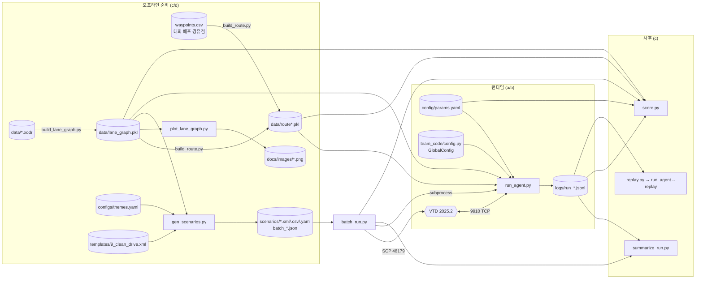

# mando 저장소 구조 개요

작성 2026-08-27, HEAD `a5b5578` 기준. 코드를 직접 읽어 확인한 것이고, 함수 내부 로직은
다루지 않는다. 불확실한 것만 **(추정)** 으로 표시했다.

---

## 0. 문서 vs 실제 코드

[README.md](../README.md) 와 [AGENT_SPEC.md](../AGENT_SPEC.md) 는 2026-08-27 에 현재 코드
기준으로 갱신됐다(구 ROS 2 워크스페이스 서술 → PDM-Lite 단일 프로세스 구조). 큰 불일치는
해소됐고, **남은 것은 아래 뿐**이다. 상세는 AGENT_SPEC §8.

| # | 규격 | 코드 | 성격 |
|---|---|---|---|
| 1 | §1.1 신호 state 0 = "제약 없음" | 0 → `Unknown` → Green 아님 → IDM 감속 ([route.py:79](../vtd_adapter/route.py#L79), [autopilot.py:1426](../team_code/autopilot.py#L1426)) | 판단 보류 — 보수 설계인지 매핑 실수인지 미확정 |
| 2 | §1.1 "소멸 ≠ 통과 허가" | `VtdTrafficLight.state` 기본값이 Green(통과) ([route.py:87](../vtd_adapter/route.py#L87)) | 판단 보류 — 폴백② 미구현과 묶임 |
| 3 | 로그 `decision.reasons` 후보명 | 구 planner 이름 10종이 항상 `null`, 실제 값은 PDM 이름으로 덮임 ([logger.py:23](../vtd_adapter/logger.py#L23), [run_agent.py:267](../run_agent.py#L267)) | 두 세트 공존 — 정리 여부 미결 |
| 4 | §3.5 횡 = Pure Pursuit | PDM `LateralPIDController` | 구조 변경(태그됨), 규격 폐기 여부 미결 |

코드 주석 쪽 stale (동작에는 영향 없음): [route.py:1-2](../vtd_adapter/route.py#L1-L2) 가
"phase2 에서 VtdRoutePlanner 추가 예정"이라 하지만 이미 같은 파일에 있다.

---

## 1. 구조 지도

태그: **(a)** 제어·판단 로직 / **(b)** VTD 연결 / **(c)** 시나리오·배치·채점 도구 / **(d)** 설정·데이터 / **(e)** 테스트

```
run_agent.py                     (a) 진입점. 어댑터+PDM 조립, 20 Hz 틱 루프, 예외 격리·로깅
│
├─ team_code/                    (a) 판단 계층 — DriveLM PDM-Lite 원문(Apache 2.0) 이식
│  ├─ autopilot.py               주행 판단 전부: IDM·OBB forecast·적색신호·조향. `# VTD:` 줄만 수정
│  ├─ config.py                  GlobalConfig — PDM 하이퍼파라미터 단일 출처 (yaml 아님)
│  ├─ lateral_controller.py      횡방향 PID (autopilot._get_steer 가 사용)
│  ├─ kinematic_bicycle_model.py 자차/타차 미래 궤적 외삽 (forecast 용)
│  └─ kr_rules.py                한국 규칙 계층: 종점 정지 + 적신호 최소 정지 유지 + 방향지시등. 접점은 autopilot:288 한 줄
│
├─ vtd_adapter/                  (b) VTD 를 CARLA 표면으로 감싸는 층 — 판단 없음
│  ├─ comm.py                    9910 TCP: 1109 B 수신 / 9 B 송신, watchdog·재접속, SAFE_STOP
│  ├─ types.py                   RawPacket / EgoState / TrackedObject / WorldState / Decision / Command
│  ├─ frame.py                   VTD ↔ CARLA 좌표·각도 변환의 **유일한** 자리
│  ├─ carla_types.py             Location/Rotation/BoundingBox/VehicleControl 등 CARLA 타입 흉내
│  ├─ ego.py                     자차 속도 추정(9910 에 속도 필드 없음) + courseRespawn 리셋 감지
│  ├─ world.py                   VtdWorld = carla.World 흉내. 객체 트래킹·80 m/30개 규칙·코스팅
│  ├─ actor.py                   VtdActor / VtdEgo = carla.Actor 흉내 (CARLA 프레임)
│  ├─ map.py                     VtdMap / VtdWaypoint = carla.Map 흉내 (lanegraph 위에 얹음)
│  ├─ lanegraph.py               lane_graph.pkl 런타임 조회 (차로 매칭·정지선·제한속도·lookahead·점선)
│  ├─ route.py                   VtdRoutePlanner (PDM 경로 플래너 표면) + 실선 LC 가드 + 신호 대조
│  ├─ control.py                 종방향 P 제어 → **accel 직접 출력**, VehicleControl → Command 변환
│  ├─ config.py                  params.yaml 로더 + end_margin_m (완주 임계 공용 함수)
│  └─ logger.py                  run_*.jsonl 틱 로그 (score/summarize/replay 의 계약 스키마)
│
├─ tools/                        (c) 오프라인·주변 도구 (런타임 import 아님, replay 만 예외)
│  ├─ build_lane_graph.py        xodr → data/lane_graph.pkl  (지도 바뀔 때만 1회)
│  ├─ build_route.py             경유점 CSV → route.pkl. run_agent --csv 와 batch_run 이 서브프로세스로 호출
│  ├─ plot_lane_graph.py         lane_graph/route 를 PNG 로 눈검사
│  ├─ probe_9910.py              9910 프레임 덤프·디코드 (comm 파서 재사용)
│  ├─ mock_vtd.py                VTD 없이 닫힌 루프 — 9910 목 서버 + 자전거 모델
│  ├─ scp_client.py              VTD SCP(48179) 제어: 시나리오 load/start/stop/카메라
│  ├─ gen_scenarios.py           configs/themes.yaml → scenarios/*.{xml,csv,yaml} + batch_*.json
│  ├─ batch_run.py               배치 실행기: build_route → SCP load/start → run_agent → 종료판정 → 로그 수집
│  ├─ replay.py                  jsonl → Comm 대체 소스(ReplaySource). run_agent --replay 가 import
│  ├─ summarize_run.py           주행 직후 성적표 (완주·과속·t_off·리스폰·winner 분포)
│  └─ score.py                   로그 → 위반 검출 + 2026 안내문 채점(구간별 감점)
│
├─ config/params.yaml            (d) **실제로 읽히는 런타임 설정.** comm/camera/vehicle/speed/
│                                    percep/control/route/route_end/batch/scoring/score/log/debug
├─ configs/themes.yaml           (d) 별개 파일. gen_scenarios 전용 시나리오 생성 프리셋
├─ templates/*.xml               (d) 검증된 VTD 시나리오 원본. gen_scenarios 가 9_clean_drive.xml 을 베이스로 사용
├─ data/                         (d) 지도·경로 자산 (xodr, lane_graph.pkl, route.pkl, junction_ctrl_map.json)
├─ docs/                         (d) lane_graph.md(지도 빌드), PDM_MIGRATION_PLAN.md(이식 계획), 이 문서
└─ tests/                        (e) pytest 20개 — comm 파싱/송신, 속도추정, 리셋, lanegraph,
                                     adapter, route_end/finish/stopline, 지시등, 실선 LC, scoring, batch, gen_scenarios
```

### config/ 와 configs/ 의 차이
- **config/params.yaml** — 런타임 단일 출처. [config.py:16](../vtd_adapter/config.py#L16) 기본값이자
  [run_agent.py:101](../run_agent.py#L101) `--config` 기본값. tools(batch_run·score·summarize_run·
  build_route·gen_scenarios)와 tests 도 같은 파일을 읽는다. **실제로 읽히는 쪽.**
- **configs/themes.yaml** — [gen_scenarios.py:59](../tools/gen_scenarios.py#L59) 만 읽는다.
  오타가 아니라 용도가 다른 파일이며 서로 참조하지 않는다.
- 판단 상수는 yaml 이 아니라 [team_code/config.py](../team_code/config.py) 가 단일 출처다.
  겹치는 값은 [run_agent.py:76-88](../run_agent.py#L76-L88) `build_pdm_config` 가 주입으로 잇는다.

### 미사용 / 참조 없음
- `data/route_official_route.pkl`, `data/official_route.csv`, `data/test_route_waypoints.csv`,
  `data/test_waypoints.csv`, `data/lane_graph.pkl.bak` — 코드·문서 어디서도 이름이 나오지 않는다 (미사용).
- `docs/myroute.png` — 참조 없음 (미사용).
- `vtd_adapter/route.py` 의 `shift_route_smoothly`([:406](../vtd_adapter/route.py#L406))·
  `shift_route_around_actors`([:434](../vtd_adapter/route.py#L434)) — 정의만 있고 호출처 없음.
  [autopilot.py:300](../team_code/autopilot.py#L300) 주석이 "kr_rules 가 부를 예정"으로 예고 (미사용, 예정).
- CLI 전용이라 import 되지 않을 뿐 **미사용이 아닌** 것: `build_lane_graph.py`, `plot_lane_graph.py`,
  `probe_9910.py`, `mock_vtd.py` (README 절차에 등장).
- `templates/` 중 `9_clean_drive.xml` 외 7개는 코드가 경로로 열지 않는다 — 이벤트 블록을 사람이
  베껴 온 참고본 **(추정)**.

---

## 2. 실행 흐름 — 한 틱

`Comm.recv() → RawPacket → Runner.tick()`([run_agent.py:219](../run_agent.py#L219))`→ Command → Comm.send()`

| 단계 | 담당 | 위치 |
|---|---|---|
| 전처리 | `EgoTracker.update` 속도·차로·route_s·리셋 → WorldState / `VtdWorld.update` 객체 트래킹 / `planner.update_lights` | [run_agent.py:221](../run_agent.py#L221), [:231-232](../run_agent.py#L231-L232) |
| **① 경로 조회** | `VtdRoutePlanner.run_step(ego_xy)` → route_np/route_wp, 다음 신호까지 거리·객체, speed_limit | [route.py:330](../vtd_adapter/route.py#L330) ← [autopilot.py:172](../team_code/autopilot.py#L172) |
| **② 기본 속도** | `speed_limit × ratio` 와 72 km/h 중 min, 전방 junction 있으면 30 km/h 캡 | [autopilot.py:194-206](../team_code/autopilot.py#L194-L206) |
| **③ 회피** | **해당 없음.** `_manage_route_obstacle_scenarios` 는 CARLA 시나리오 전용 640줄을 걷어낸 stub — 항상 통과값 반환. 차로 시프트는 정의만 있고 미호출 | [autopilot.py:293-306](../team_code/autopilot.py#L293-L306) |
| **④ 판단(min)** | `get_brake_and_target_speed` 에서 선행차 IDM·보행자·차량·자전거·적색신호 후보의 min → `kr_rules.apply` 가 **종점 정지·적신호 정지유지 후보를 같은 축에 덧대고**, 낮으면 종방향을 되감아 재계산 | [autopilot.py:911](../team_code/autopilot.py#L911), [:288](../team_code/autopilot.py#L288) → [kr_rules.py:152-214](../team_code/kr_rules.py#L152-L214) |
| ④-로깅 | `LoggingAutoPilot` 이 후보 함수 **반환값만** 가로채 winner/reasons 를 만든다 (판단 불개입) | [run_agent.py:109-142](../run_agent.py#L109-L142), [:243](../run_agent.py#L243) |
| **⑤ 실행** | 종: `VtdLongitudinalController` → **accel[m/s²]**(throttle 자리) / 횡: `_get_steer` → LateralPID / 변환: `command_from_control` → `Comm.send` 9 B | [control.py:59](../vtd_adapter/control.py#L59), [autopilot.py:308](../team_code/autopilot.py#L308), [run_agent.py:235](../run_agent.py#L235) |
| **⑥ 안전망** | ⓐ 틱 예외 3연속 → `SAFE_STOP`(accel −3.0) [run_agent.py:324-331](../run_agent.py#L324-L331)<br>ⓑ `stale()`(watchdog_s 무수신) → SAFE_STOP + reconnect [run_agent.py:335-338](../run_agent.py#L335-L338)<br>ⓒ 리셋 시 world·경로 인덱스·조향·accel 이력 초기화 [run_agent.py:222-229](../run_agent.py#L222-L229)<br>ⓓ PDM 내부: 정지 롤백 방지 brake, `max_blocked_ticks` 초과 시 강제 throttle<br>**없는 것: shield(corridor·실선·중앙선·TTC 비상제동) 계층** |

리셋(courseRespawn)은 ①보다 먼저 처리된다 — 순간이동 전 인덱스·제어 이력을 전부 버린다.

---

## 3. 데이터 흐름



### 자산별 생성처 → 소비처
| 파일 | 만드는 곳 | 읽는 곳 |
|---|---|---|
| `data/lane_graph.pkl` | `build_lane_graph.py` (xodr 1회) | `lanegraph.py` → map/route/ego, build_route, gen_scenarios, plot, score, summarize, 테스트 |
| `data/route*.pkl` | `build_route.py`. `run_agent --csv` 와 `batch_run` 이 서브프로세스로 호출 | `run_agent.load_route` → EgoTracker / VtdRoutePlanner / kr_rules, score, summarize, plot |
| `waypoints.csv` (루트) | 대회/사람이 배포 | build_route, gen_scenarios(themes 경로 풀 `csv:`) |
| `logs/run_*.jsonl` | `logger.py` (매 틱, 별도 스레드) | summarize_run, score, replay(ReplaySource) → run_agent 재생, batch_run 종료 판정 |
| `config/params.yaml` | 사람이 편집 | `config.py` → run_agent(+PDM 주입)·batch_run·score·summarize_run·build_route·gen_scenarios·tests |
| `configs/themes.yaml` | 사람이 편집 | gen_scenarios 전용 |
| `data/junction_ctrl_map.json` | 저장소에 포함 (생성 스크립트 없음 **(추정)**) | `route.py`, `gen_scenarios.py` |

### vtd_adapter ↔ VTD
- **받는 것**: 9910 TCP 1109 B 고정 프레임 20 Hz — ego 6f(x,y,z,heading,pitch,roll) + 객체 30개
  (id,pos,heading,speed,LWH) + 신호등 1칸(controller id, state). 밀린 프레임은 버리고 최신 1개만.
- **보내는 것**: 9 B `<ffB` = steering[rad] · targetAccel[m/s²] · turnSignal(0/1/2 — kr_rules 가 경로 이벤트로 판단)
  을 20 Hz 지속 송신. (별도 채널: `scp_client.py` 가 SCP 48179 로 시나리오 load/start/stop·카메라)

### tools 파이프라인 순서
`build_lane_graph`(지도 1회) → `build_route`(경로) → `gen_scenarios`(시나리오·batch 목록) →
`batch_run`(SCP 로드 · `run_agent` 실행 · 종료 판정) → `summarize_run`(즉시 성적표) →
`score`(감점 채점) → 이상 항목만 `replay`.
